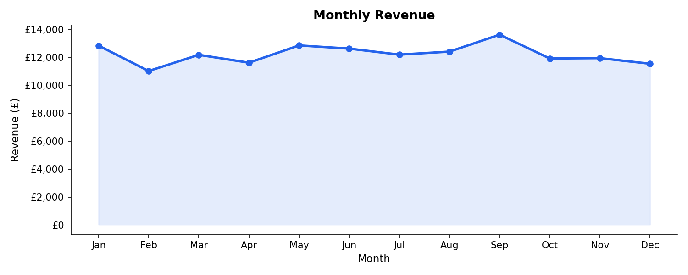
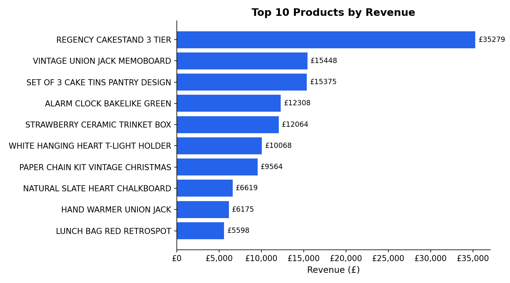
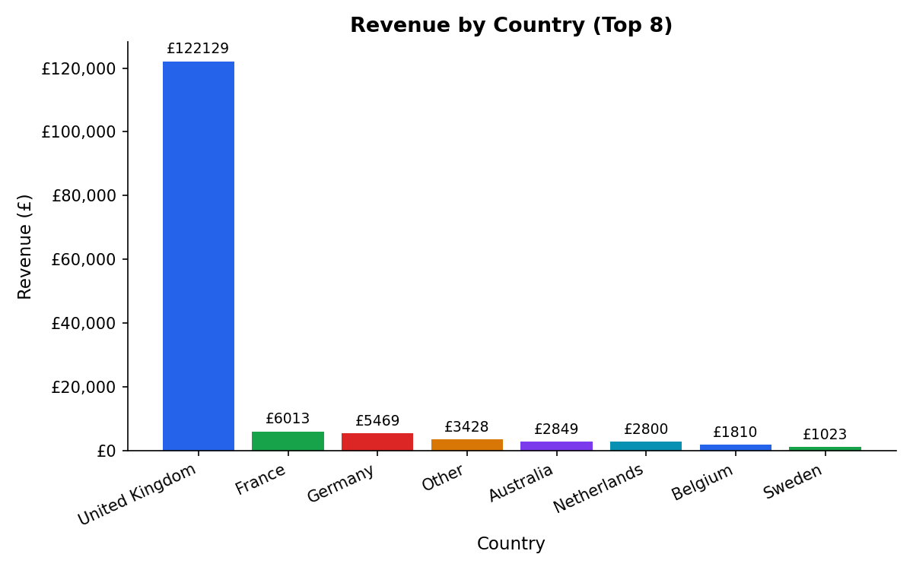
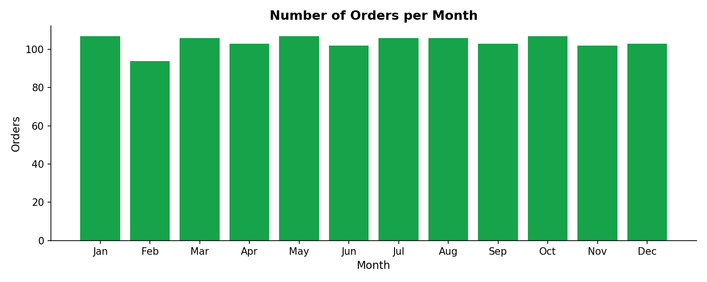
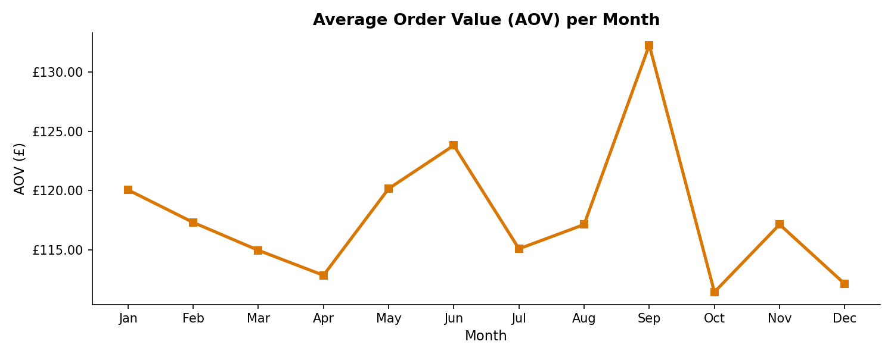
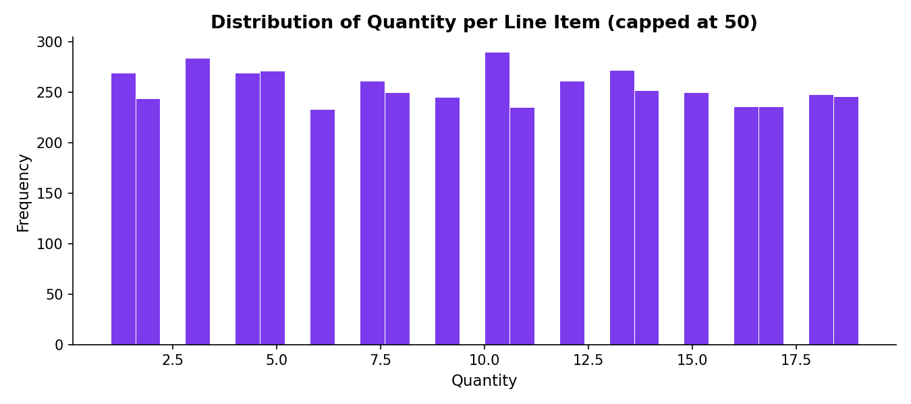

# 🛒 E-Commerce Data Analysis

Exploratory data analysis of an online retail store's transactional data.  
The goal is to extract actionable business insights from raw sales records using Python.

---

## 📊 Key Findings

| KPI | Value |
|-----|-------|
| Total Revenue | £146,813 |
| Total Orders | 1,246 |
| Unique Customers | 1,131 |
| Average Order Value | £117.83 |
| Avg. Revenue per Customer | £129.81 |
| Top Market | United Kingdom (82%) |

---

## 📈 Visualizations

### Monthly Revenue Trend


### Top 10 Products by Revenue


### Revenue by Country


### Orders per Month


### Average Order Value Trend


### Quantity Distribution


---

## 🗂️ Project Structure

```
ecommerce-data-analysis/
│
├── main.py               # Main analysis script
├── online_retail.csv     # Dataset (auto-generated if not present)
├── requirements.txt      # Python dependencies
└── plots/                # Generated visualizations
    ├── 01_monthly_revenue.png
    ├── 02_top_products.png
    ├── 03_revenue_by_country.png
    ├── 04_orders_per_month.png
    ├── 05_aov_trend.png
    └── 06_quantity_distribution.png
```

---

## 🚀 Getting Started

### 1. Clone the repository
```bash
git clone https://github.com/Outman20/Ecommerce-Data-Analysis.git
cd Ecommerce-Data-Analysis
```

### 2. Install dependencies
```bash
pip install -r requirements.txt
```

### 3. Run the analysis
```bash
python main.py
```

The script will automatically generate a sample dataset if `online_retail.csv` is not found.  
To use the real dataset, download it from the [UCI ML Repository](https://archive.ics.uci.edu/dataset/352/online+retail) and place it in the root folder.

---

## 🧰 Tech Stack

| Tool | Purpose |
|------|---------|
| Python 3.10+ | Core language |
| Pandas | Data manipulation & cleaning |
| NumPy | Numerical operations |
| Matplotlib | Data visualization |

---

## 📌 Analysis Steps

1. **Data Loading** — Load CSV with encoding handling and auto-generate sample if needed
2. **Data Cleaning** — Remove cancellations (invoices starting with "C"), null CustomerIDs, zero/negative quantities and prices
3. **Feature Engineering** — Calculate `Revenue = Quantity × UnitPrice`, extract month/year from dates
4. **KPI Calculation** — Total revenue, AOV, orders, unique customers, top country
5. **Visualization** — 6 charts covering revenue trends, product performance, geographic breakdown, and customer behavior

---

## 👤 Author

**Outman Baroudi**  
B.Sc. Artificial Intelligence / Data Science — Hochschule Aalen  
[GitHub](https://github.com/Outman20) · [Email](mailto:outman2003@gmail.com)
